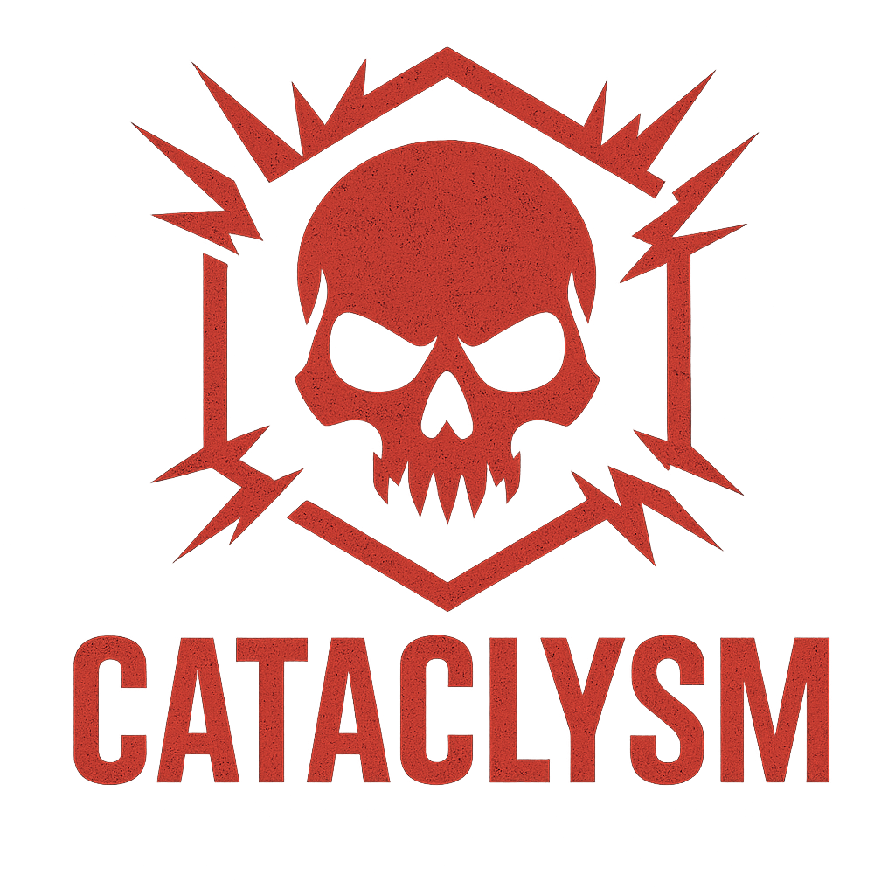

  

<h1 align="center">☣️ CATACLYSM ☣️</h1>

  
  

  <em>For those who seek chaos, this is where skill meets mayhem.</em>

---

## ⚔️ Overview

**Cataclysm** is not your typical vulnerable machine, it's a chaos simulator designed to test your **red teaming** and **penetration testing** skills.

---

## Challenges

- Enumeration
- Exploitation
- Multi-Stage Container Pivoting
- Reverse Engineering
- Privilege Escalation

---

## Technical Details

| Component | Description |
|------------|-------------|
| **Base OS** | Ubuntu 20.04 LTS |
| **Difficulty** | Medium/Hard |
| **Format** | OVA |
| **Flags** | 5  |
| **Author** | **Dion Mulaj** |

---

## Installation

1. Download the OVA file from the download links below.
2. Import the OVA into **VirtualBox** or **VMware**.  
3. Configure network mode.  
4. Start the machine and begin the hunt.

---

## Download Links
MediaFire: https://www.mediafire.com/file/vib87je2c7aeq29/Cataclysm.rar  
UFile: https://ufile.io/oixuo2hy

---

## Troubleshooting

In case you get an Adapter Error while starting the machine, just re-select your network adapter and generate a new random MAC address.

---

## ⚠️ Warning
 
This virtual machine is **intentionally vulnerable** and should be used **only in isolated lab environments**.  

---

---

## Author

**👤 Dion Mulaj**  
Offensive Cybersecurity Engineer | Vulnerable Machine Developer | Content Writer 

---

